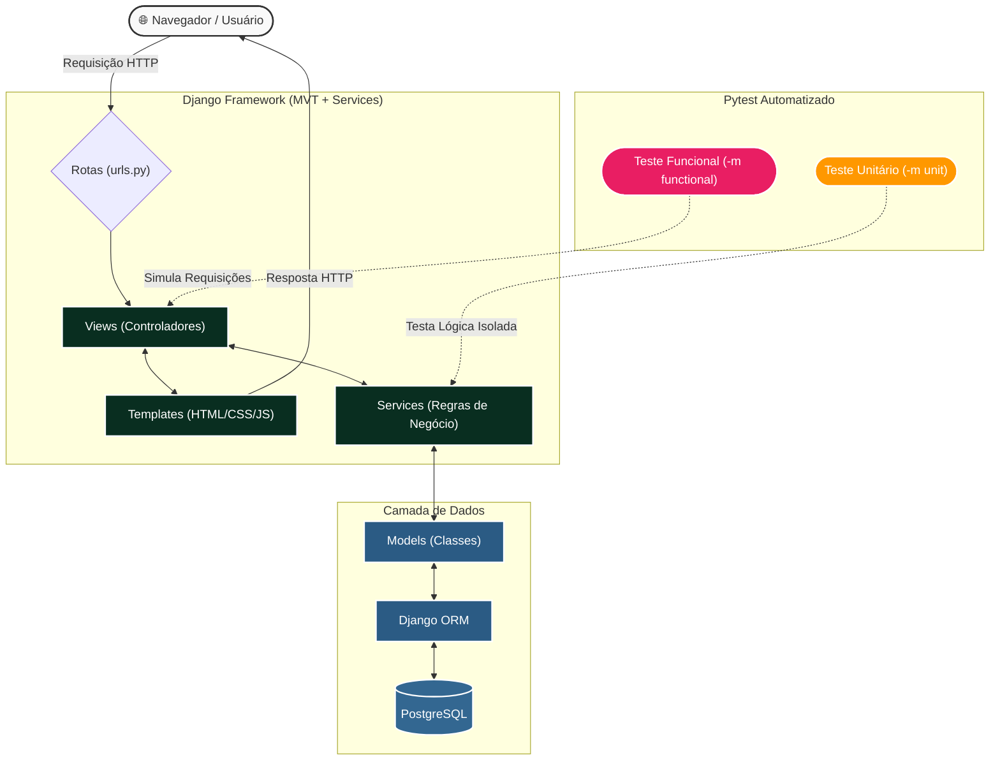

# Troca Justa Charqueadas

## Arquitetura do Sistema

Para entender como a plataforma funciona por debaixo dos panos, utilizamos o padrão nativo **MVT** (Model-View-Template) com o acréscimo de uma **Service Layer** para regras de negócio. O diagrama abaixo detalha o fluxo de dados e a divisão dos testes automatizados:



### Entendendo o Fluxograma

Este diagrama ilustra o **Ciclo de Vida de uma Requisição** e como a inteligência do código está dividida:
1. **As Setas Unilaterais (Ida e Volta):** Representam o fluxo da Internet. O Usuário faz um pedido HTTP numa via de mão única até as `Rotas`, que por sua vez delegam o trabalho para as `Views`. No fim do processo, o `Template` devolve a resposta final (HTML) para a tela do usuário de uma vez só.

2. **As Setas Bilaterais (Processamento Interno):** Representam a "conversa" do sistema. A `View` vai até os `Services` (pedir aplicação de regras), que vão até as `Models` (pedir dados), que vão até o `PostgreSQL`. A resposta faz o caminho inverso, gerando as setas de duas pontas.

3. **A Separação de Testes:** As setas pontilhadas revelam a estratégia do Pytest. O `-m functional` atua como um boneco de testes batendo direto nas Views (testando o ciclo web). O `-m unit` ataca apenas as peças isoladas do Service (testando a matemática/lógica por trás).


##  Como Rodar o Projeto

Certifique-se de que o **Docker Desktop** esteja aberto e em execução.

### 1. Subir os Containers
Abra o terminal na pasta raiz do projeto (`c:\Users\dante\Desktop\Tcc`) e execute:
```bash
docker compose up
```
*(Use `docker compose up --build` apenas na primeira vez ou caso adicione novas dependências no `requirements.txt`).*

> 💡 **Dica:** Para subir em segundo plano e **liberar o terminal atual** sem precisar abrir outra janela para rodar os comandos seguintes, use:
> ```bash
> docker compose up -d
> ```

### 2. Criar as Tabelas no Banco de Dados (Migrações)
Com os containers rodando, abra uma **nova janela de terminal** na raiz do projeto e execute:
```bash
docker compose exec web python manage.py migrate
```

### 3. Criar a Conta de Administrador (Superuser)
Para ter acesso ao painel administrativo do Django, crie seu superusuário rodando:
```bash
docker compose exec web python manage.py createsuperuser
```
> **Nota:** Como o projeto usa o e-mail como autenticação principal, o prompt do terminal solicitará nesta ordem: **E-mail**, **Username**, **Nome completo**, **Telefone** e **Senha**.

### 4. Links de Acesso
Após seguir os passos acima, acesse o projeto através dos links abaixo:
* 💻 **Interface do Sistema:** [http://localhost:8000](http://localhost:8000)
* ⚙️ **Painel do Administrador:** [http://localhost:8000/admin](http://localhost:8000/admin)

### 5. Executando os Testes Automatizados (Pytest)
A plataforma possui uma suíte de testes com separação arquitetural (Unitários vs Funcionais). Garanta que os containers estão rodando e execute os comandos abaixo em uma nova aba do terminal:

**Testes Unitários (Apenas lógica e regras de negócio):**
```bash
docker compose exec web pytest -m unit -v
```

**Testes Funcionais (Simulação de fluxos de navegação e telas):**
```bash
docker compose exec web pytest -m functional -v
```

**Rodar todos os testes (Suíte Completa):**
```bash
docker compose exec web pytest -v
```
*(Nota: Se houver problemas de módulos ausentes, rode `docker compose up --build -d` para garantir que o pytest foi instalado dentro do container).*

---

## Comandos Úteis (Docker)

* **Parar os containers:**  
  ```bash
  docker compose down
  ```
* **Zerar o banco de dados e recomeçar do zero:**  
  *(Atenção: isso apagará todos os dados cadastrados no banco)*
  ```bash
  docker compose down -v
  ```
* **Criar novas migrações** *(rode sempre que alterar algo em `models.py`)*:  
  ```bash
  docker compose exec web python manage.py makemigrations
  ```
* **Aplicar migrações novas** *(rode após criar novas migrações)*:  
  ```bash
  docker compose exec web python manage.py migrate
  ```

---
